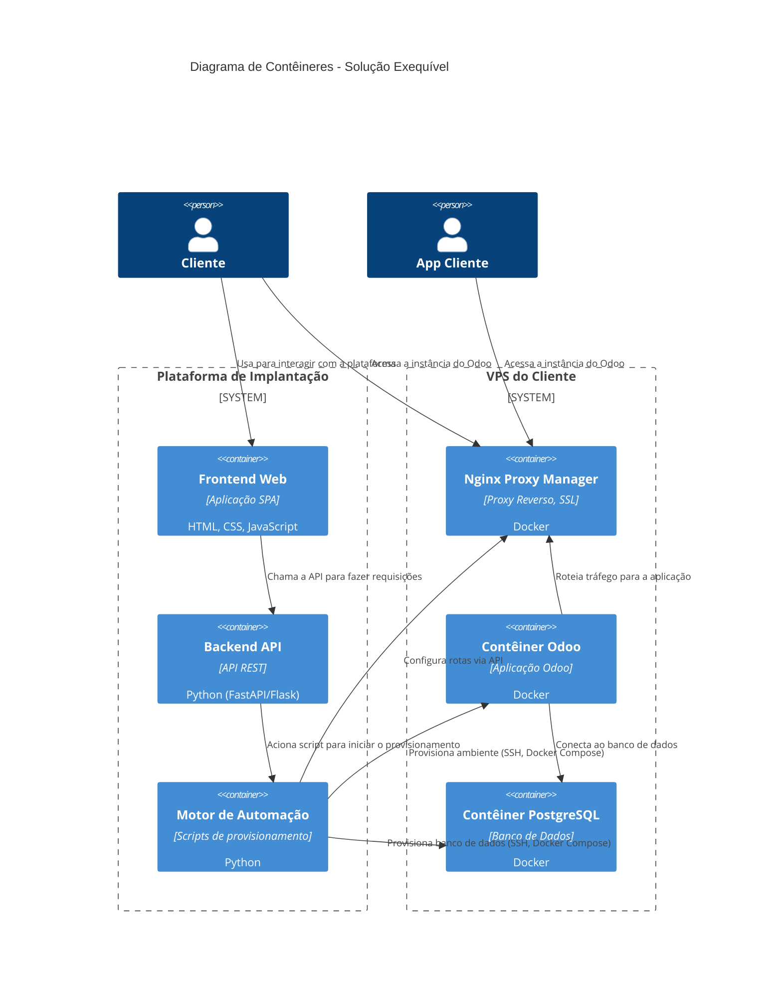

# Sobre
### Documentação do Odoo ERP
Estou estudando Odoo e a mameira mais fácil que eu achei de documentar os estudos foi construindo essa documentação paralela.

Qualquer dúvida ou sugestão é só entrar em contato com <felipexcavalcante@gmail.com> ou através da página do github deste projeto <strong style="color: red">colocar aqui o endereço do github e como contribuir</strong>

```mermaid
graph TD
subgraph "Cliente"
    A[Navegador do Cliente]
end

subgraph "Sua Plataforma Web"
    B[Frontend Web]
    C[Backend/API]
    D[Orquestrador (K8s API)]
end

subgraph "Infraestrutura Hetzner"
    subgraph "Cluster Kubernetes"
        E(Ingress Controller)
        subgraph "Namespace Cliente 1"
            F[Contêiner Odoo]
        end
        subgraph "Namespace Cliente 2"
            G[Contêiner Odoo]
        end
    end
    subgraph "Serviço de BD Gerenciado"
        H[Banco de Dados Cliente 1]
        I[Banco de Dados Cliente 2]
    end
end

A --> |HTTPS| E
E --> |Roteamento K8s| F & G
C --> |Chamada API Helm/K8s| D
D --> |Deploy de Contêiner| F & G
F --> H
G --> I

style A fill:#bbf,stroke:#333,stroke-width:2px;
style B fill:#bbf,stroke:#333,stroke-width:2px;
style C fill:#bbf,stroke:#333,stroke-width:2px;
style D fill:#bbf,stroke:#333,stroke-width:2px;
style F fill:#f9f,stroke:#333,stroke-width:2px;
style G fill:#f9f,stroke:#333,stroke-width:2px;
style E fill:#9cf,stroke:#333,stroke-width:2px;
style H fill:#f9f,stroke:#333,stroke-width:2px;
style I fill:#f9f,stroke:#333,stroke-width:2px;
```

