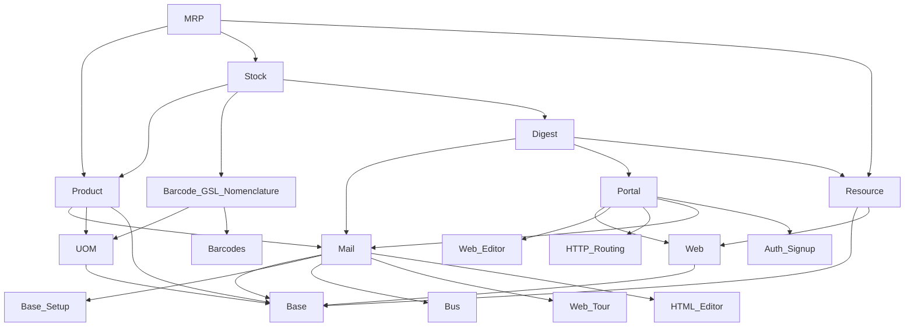
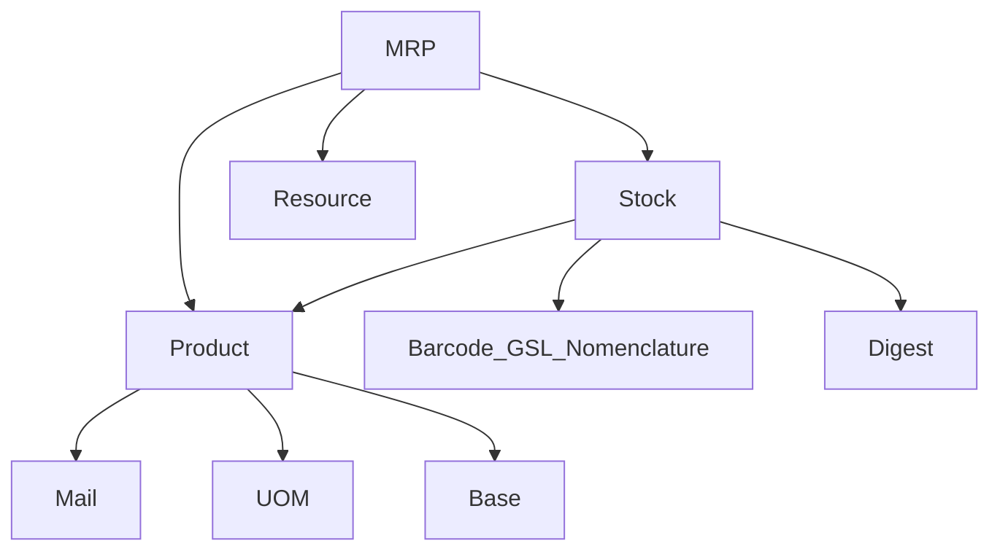
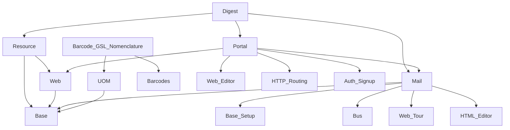

## Relação entre os módulos

```mermaid
graph TD

    MRP --> Product
    MRP --> Stock
    MRP --> Resource

    Product --> Mail
    Product --> UOM
    Product --> Base

    Stock --> Product
    Stock --> Barcode_GSL_Nomenclature
    Stock --> Digest

    Resource --> Base
    Resource --> Web

    Web --> Base

    Mail --> Base
    Mail --> Base_Setup
    Mail --> Bus
    Mail --> Web_Tour
    Mail --> HTML_Editor

    UOM --> Base

    Barcode_GSL_Nomenclature --> UOM
    Barcode_GSL_Nomenclature --> Barcodes

    Digest --> Mail
    Digest --> Portal
    Digest --> Resource

    Portal --> Web
    Portal --> Web_Editor
    Portal --> HTTP_Routing
    Portal --> Mail
    Portal --> Auth_Signup
```
*Confuso, né? Isso foi só pra dar um susto.*

Vamos estudar os casos separadamente

```mermaid
graph TD

    MRP --> Product
    MRP --> Stock
    MRP --> Resource

    Product --> Mail
    Product --> UOM
    Product --> Base

    Stock --> Product
    Stock --> Barcode_GSL_Nomenclature
    Stock --> Digest
```

```mermaid
graph TD

    Resource --> Base
    Resource --> Web

    Web --> Base

    Mail --> Base
    Mail --> Base_Setup
    Mail --> Bus
    Mail --> Web_Tour
    Mail --> HTML_Editor

    UOM --> Base

    Barcode_GSL_Nomenclature --> UOM
    Barcode_GSL_Nomenclature --> Barcodes

    Digest --> Mail
    Digest --> Portal
    Digest --> Resource

    Portal --> Web
    Portal --> Web_Editor
    Portal --> HTTP_Routing
    Portal --> Mail
    Portal --> Auth_Signup
```

